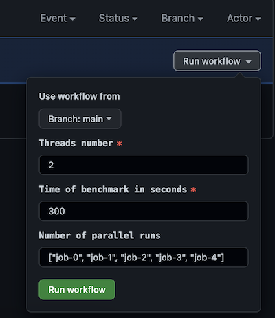

# actions-runner-benchmark

This repository contains the GitHub workflow prepared to run multiple instances of sysbench on worker.
Main reason behind this project is to test scaling of self-hosted action runners.

Please fork this repository and configure your self-hosted runner against this repository to run benchmark.

GitHub action is triggered manually by workflow_dispatch. 
Agruments are Threads number, Time of benchmark in seconds (arguments for sysbench) 
and Number of parallel runs - which is the argument to matrix strategy of gh action.

